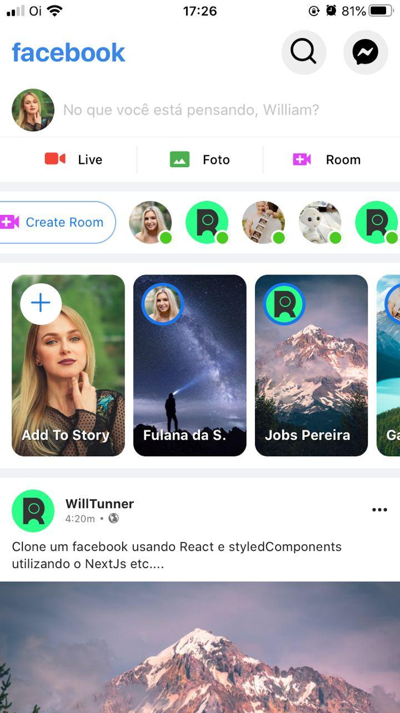

#Recriando interface do FaceBook com ReactNative
# Clone FaceboookApp
> Projeto criado em base de estudar styledComponent 

#### O Frontend do App foi feito em ReactNative com StyledComponent basicamente

## Imagens do projeto
### Tamanho web

### Tamanho Tablet

## Como usar:
1. Baixe o projeto 
2. Use: "npm install" para baixar os node_modules
3. Depois use: "expo start" para iniciar o projeto

## Conteudo desse estudo
* Expo
* ReactNative
* StyledComponents
* JavaScript